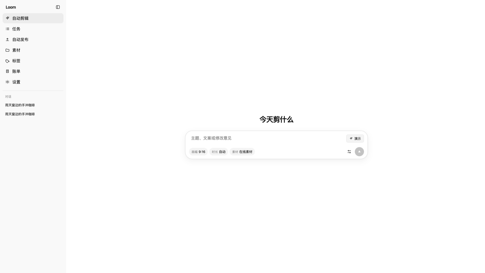
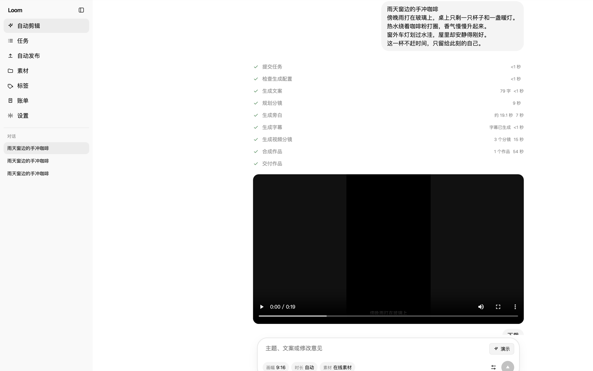

# video-loom

[](LICENSE)
[](pyproject.toml)
[](main.py)
[](webui/src/main.tsx)





**Loom** 是独立的短视频自动剪辑 Agent：输入主题或文案，自动完成脚本、导演规划、配音字幕、分镜素材补齐与成片导出。

主链路由 **LangGraph** 编排，业务能力拆成可替换的 **tool**；缺镜时依次走素材库、在线检索和 Seedance，不再卡在人工上传确认。

---

## 能做什么

| 能力 | 说明 |
| --- | --- |
| 自动剪辑 | 主题 → 文案 → 配音/字幕 → 分镜素材 → 时间轴 → 成片 |
| 导演规划 | 推断段落结构、配音节奏、镜头与转场参数 |
| 素材补齐 | `local_first`：库内匹配 + 在线检索，缺镜自动 Seedance；`ai_generated`：按分镜直接生成 |
| 任务管理 | 列表、详情、取消、重试、删除、预览与下载 |
| 素材与标签 | 上传、检索、打标、标签管理；分镜可自动入库 |
| 账单 | Seedance 用量与费用汇总 |
| 工作台 | React / TanStack WebUI + FastAPI |

---

## 技术栈

- **后端**：Python 3.11+、FastAPI、Uvicorn、LangGraph
- **前端**：Vite、React、TypeScript；TanStack Router / Query / Table / Form
- **媒体**：MoviePy、FFmpeg、Edge TTS、faster-whisper
- **模型**：LiteLLM / OpenAI 兼容接口（Moonshot、OpenAI、Gemini、DeepSeek 等）
- **可选**：Redis、Docker Compose、TwelveLabs（语义素材排序）

---

## 环境要求

- Python 3.11+
- [uv](https://github.com/astral-sh/uv)（推荐，用 `uv.lock` 固定依赖）
- FFmpeg
- Node.js 18+（构建 WebUI）
- 可用的 LLM、TTS；需要自动补镜时配置 Seedance

---

## 快速开始

```bash
cp config.example.toml config.toml
# 编辑 config.toml：填写 llm_provider、API Key、material_strategy 等

uv sync --frozen
./webui.sh          # Linux / macOS
# 或 Windows：
webui.bat
```

本地开发（API 热重载 + 前端 HMR）推荐：

```bash
# 虚拟环境目录为 .venv-video-loom（由 UV_PROJECT_ENVIRONMENT / .env 指定）
cp .env.example .env
uv sync

# Windows 一键开两个窗口：
dev.bat

# 或手动：
# 终端 1
.\.venv-video-loom\Scripts\python.exe main.py
# 终端 2
cd webui && npm run dev
```

启动后：

| 入口 | 地址 |
| --- | --- |
| 工作台 | http://127.0.0.1:8080 |
| API 文档 | http://127.0.0.1:8080/docs |

脚本会在需要时安装前端依赖并构建 `webui/dist`，再由 FastAPI 托管前后端。

### 前后端分开开发

```bash
# 终端 1：API
uv run python main.py

# 终端 2：前端（热更新，代理到 8080）
cd webui && npm install && npm run dev
```

前端开发地址：http://127.0.0.1:8501

---

## Docker

```bash
docker compose up --build
```

| 服务 | 地址 |
| --- | --- |
| WebUI（映射） | http://127.0.0.1:8501 |
| API | http://127.0.0.1:8080 |
| API 文档 | http://127.0.0.1:8080/docs |

请将本地 `config.toml`、`storage/` 挂载进容器（见 `docker-compose.yml`）。

---

## 配置要点

```bash
cp config.example.toml config.toml
```

**不要提交**本地 `config.toml`（可能含密钥）。

常用项：

| 配置 | 作用 |
| --- | --- |
| `llm_provider` | 大模型提供商（如 `moonshot`、`openai`、`gemini`） |
| 各 `*_api_key` | LLM / 素材站 / Seedance 等密钥 |
| `material_strategy` | `local_first` 或 `ai_generated` |
| `video_sources` | 在线素材源，如 pexels、pixabay、coverr |
| `listen_host` / `listen_port` | API 监听地址，默认 `8080` |
| `reload_debug` | 本地开发热重载（Uvicorn）；生产请保持 `false` |

素材策略：

- **`local_first`**：优先素材库与在线检索，仍缺镜则自动 Seedance；补不齐则任务失败。
- **`ai_generated`**：按分镜规划直接生成镜头，不依赖上传关卡。

---

## 使用流程

1. 复制并填写 `config.toml`。
2. 启动工作台，打开 **自动剪辑**。
3. 输入主题或文案，创建任务。
4. Agent 依次完成：预检 → 文案 → 导演 → 分镜 → 旁白 → 字幕 → 素材 → 时间轴 → 导出。
5. 在 **任务** 中预览、下载、重试或删除；在 **素材 / 标签 / 账单 / 设置** 中管理资源与配置。

---

## Agent Skill

把 `docs/skill` 交给支持 Agent Skill 的客户端后，只需提供主题，即可自动复用或安装 video-loom、补齐密钥并导出成片。

```bash
# 工作目录必须是 docs/skill
uv run --no-project --python 3.11 python loom_agent.py --subject "你的主题"
```

协议与默认行为见 `docs/skill/SKILL.md`。缺密钥时会一次列出 LLM 与 Seedance（火山方舟）所需字段。

---

## Agent 流水线

```text
preflight → script → director → scenes → audio → subtitle
         → materials → timeline → refine → export
```

生产类 tool（文案、导演、分镜、TTS、字幕、素材匹配、Seedance、BGM）与剪辑类 tool（探测、裁剪、拼接、缩放、变速、混音、字幕烧录、转场、时间轴导出）注册在 `app/tools/`，由节点按需调用。

---

## API 概览

前缀：`/api/v1`。完整契约以 http://127.0.0.1:8080/docs 为准。

| 方法 | 路径 | 说明 |
| --- | --- | --- |
| `POST` | `/api/v1/scripts` | 生成脚本文案 |
| `POST` | `/api/v1/videos` | 创建视频任务（入队 LangGraph Agent） |
| `GET` | `/api/v1/tasks` | 任务列表 |
| `GET` | `/api/v1/tasks/{task_id}` | 任务详情 |
| `POST` | `/api/v1/tasks/{task_id}/cancel` | 取消 |
| `POST` | `/api/v1/tasks/{task_id}/retry` | 重试 |
| `GET` | `/api/v1/materials` | 素材库 |
| `GET` / `PUT` | `/api/v1/settings` | 读写工作台配置 |
| `GET` | `/api/v1/billing/seedance` | Seedance 账单 |

---

## 目录结构

```text
app/
  agent/          LangGraph 状态机与节点
  tools/          生产 / 剪辑 tool 注册表
  timeline/       时间轴模型与编译
  services/       文案、TTS、素材、合成、任务存储等
  controllers/    FastAPI 路由
webui/            React 工作台（自动剪辑、任务、素材、标签、账单、设置）
resource/         字体、公共资源、内置音乐
storage/          本地缓存、素材与任务产物（勿提交密钥与大文件）
test/             测试
docs/skill/       Agent Skill（主题 → 成片）
config.example.toml
main.py           API 入口（可托管已构建的 WebUI）
cli.py            命令行入口
```

---

## 开发与测试

```bash
uv sync --frozen
uv run python -X utf8 -m pytest -q test
uv run ruff check .
```

可选 TwelveLabs：

```bash
uv sync --extra twelvelabs
```

前端：

```bash
cd webui
npm install
npm run build
```

---

## 数据与安全

- `config.toml` 只放在本机或受控部署环境。
- `storage/` 含上传素材与生成结果，注意备份与清理。
- 对外暴露 API 前请配置鉴权、HTTPS 与网络访问控制。

---

## 许可

本仓库采用 [MIT License](LICENSE)。

使用时请同时遵守第三方依赖、模型与素材服务的许可和使用规定。
